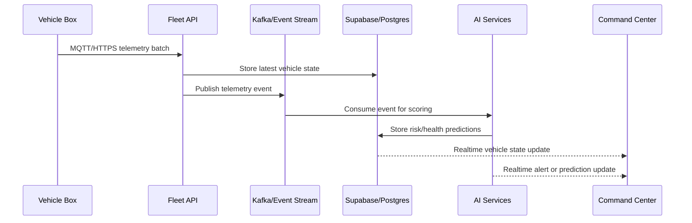
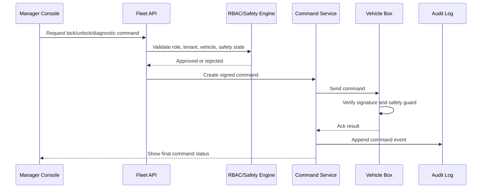

# System Architecture

## High-Level Architecture

```mermaid
flowchart TB
    subgraph Mobile["Mobile Apps"]
        CustomerApp["Customer App"]
        DriverApp["Driver App"]
        StaffApp["Staff App"]
        MaintenanceApp["Maintenance App"]
    end

    subgraph Web["Web Console"]
        AdminPortal["Platform Admin"]
        OwnerPortal["Owner Dashboard"]
        CommandCenter["Fleet Command Center"]
    end

    subgraph Edge["Vehicle Edge Hardware"]
        VehicleBox["FlashFleet Vehicle Box"]
        SecureElement["Secure Element"]
        GPS["GPS/GNSS"]
        LTE["LTE/NB-IoT"]
        BLE["Bluetooth LE"]
        Optical["Photodiode Optical Receiver"]
        OBD["OBD-II/CAN"]
        Relay["Lock/Immobilizer Control"]
        Sensors["IMU/Tamper/Backup Battery"]
    end

    subgraph Backend["Cloud Backend"]
        Supabase["Supabase Postgres/Auth/Storage"]
        API["Fleet API"]
        Realtime["Realtime Channels"]
        CommandSvc["Command Service"]
        AccessSvc["Access Token Service"]
        BookingSvc["Rental Booking Service"]
        Kafka["Kafka Event Stream"]
    end

    subgraph AI["AI Services"]
        RiskAI["Driver Risk Scoring"]
        HealthAI["Predictive Maintenance"]
        DamageAI["Damage Detection"]
        TheftAI["Anti-Theft Anomaly Detection"]
        EnergyAI["EV Energy Optimization"]
    end

    subgraph Ops["Operations"]
        Monitoring["Monitoring and Alerts"]
        Audit["Audit Log"]
        OTA["Firmware OTA"]
        DataLake["Analytics Warehouse"]
    end

    CustomerApp --> API
    DriverApp --> API
    StaffApp --> API
    MaintenanceApp --> API
    AdminPortal --> API
    OwnerPortal --> API
    CommandCenter --> Realtime

    VehicleBox --> LTE
    VehicleBox --> BLE
    VehicleBox --> Optical
    VehicleBox --> OBD
    VehicleBox --> Relay
    VehicleBox --> Sensors
    VehicleBox --> SecureElement
    LTE --> API

    API --> Supabase
    API --> Kafka
    API --> CommandSvc
    API --> AccessSvc
    API --> BookingSvc
    CommandSvc --> VehicleBox
    AccessSvc --> VehicleBox
    Kafka --> RiskAI
    Kafka --> HealthAI
    Kafka --> DamageAI
    Kafka --> TheftAI
    Kafka --> EnergyAI
    Kafka --> DataLake
    API --> Audit
    OTA --> VehicleBox
    Monitoring --> API
```

## Runtime Layers

| Layer | Responsibility |
| --- | --- |
| Mobile | User access, booking, identity verification, inspections, Bluetooth and optical unlock. |
| Web Console | Command center, analytics, operations, admin, maintenance planning. |
| API | Business logic, RBAC, command orchestration, token issuance, booking lifecycle. |
| Supabase | Auth, Postgres data, row-level security, storage for documents and media. |
| Kafka | Durable telemetry and event stream for real-time processing and AI. |
| AI Services | Risk, health, theft, damage, and energy prediction models. |
| Vehicle Box | Secure edge execution, offline unlock validation, telemetry capture, lock control. |
| Operations | Monitoring, incident response, OTA updates, observability, compliance exports. |

## Production Deployment

Recommended deployment on Microsoft Azure:

- Azure Kubernetes Service for API and AI services.
- Azure Database for PostgreSQL or Supabase managed Postgres for application data.
- Azure Event Hubs or Kafka-compatible streaming for telemetry.
- Azure Blob Storage for inspection media, documents, and AI artifacts.
- Azure Key Vault for backend keys and signing material.
- Azure Monitor and Application Insights for observability.
- CDN for web console assets.

## Real-Time Data Flow

## Command Flow

