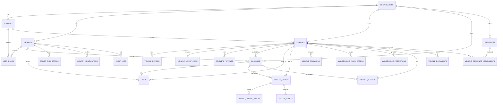

# Database ERD

```mermaid
erDiagram
    ORGANIZATIONS ||--o{ BRANCHES : has
    ORGANIZATIONS ||--o{ PROFILES : owns
    ORGANIZATIONS ||--o{ VEHICLES : owns
    ORGANIZATIONS ||--o{ BOOKINGS : owns
    ORGANIZATIONS ||--o{ GEOFENCES : defines

    PROFILES ||--o{ USER_ROLES : receives
    BRANCHES ||--o{ USER_ROLES : scopes
    BRANCHES ||--o{ VEHICLES : stores

    VEHICLES ||--o{ VEHICLE_DEVICES : uses
    VEHICLES ||--|| VEHICLE_LATEST_STATE : reports
    VEHICLES ||--o{ TELEMETRY_EVENTS : emits
    VEHICLES ||--o{ BOOKINGS : booked_for
    VEHICLES ||--o{ TRIPS : used_in
    VEHICLES ||--o{ ACCESS_GRANTS : grants
    VEHICLES ||--o{ VEHICLE_COMMANDS : receives
    VEHICLES ||--o{ MAINTENANCE_WORK_ORDERS : needs
    VEHICLES ||--o{ MAINTENANCE_PREDICTIONS : predicts
    VEHICLES ||--o{ DAMAGE_REPORTS : has
    VEHICLES ||--o{ VEHICLE_DOCUMENTS : stores

    BOOKINGS ||--o{ TRIPS : creates
    BOOKINGS ||--o{ ACCESS_GRANTS : authorizes
    BOOKINGS ||--o{ DAMAGE_REPORTS : documents

    ACCESS_GRANTS ||--o{ OFFLINE_UNLOCK_TOKENS : issues
    ACCESS_GRANTS ||--o{ ACCESS_EVENTS : produces

    GEOFENCES ||--o{ VEHICLE_GEOFENCE_ASSIGNMENTS : assigned
    VEHICLES ||--o{ VEHICLE_GEOFENCE_ASSIGNMENTS : assigned

    PROFILES ||--o{ BOOKINGS : customer
    PROFILES ||--o{ TRIPS : driver
    PROFILES ||--o{ DRIVER_RISK_SCORES : scored
    PROFILES ||--o{ IDENTITY_VERIFICATIONS : verifies
    PROFILES ||--o{ AUDIT_LOGS : acts
```
