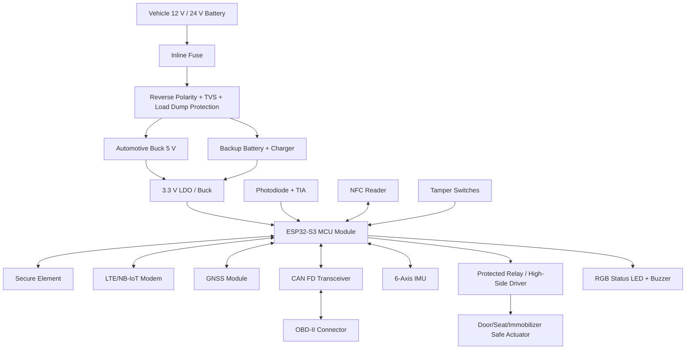
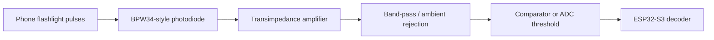
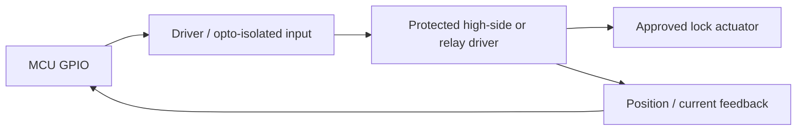

# Vehicle Box Circuit Diagram

This is a production-oriented reference circuit, not a final PCB. A final board needs electrical validation, EMC testing, thermal review, automotive compliance review, and vehicle-specific installation approval.

## Hardware Block Diagram

## Reference Wiring Table

| Signal | From | To | Interface | Notes |
| --- | --- | --- | --- | --- |
| VIN | Vehicle battery | Fuse/protection | Power | Fuse close to tap point. |
| 5V_SYS | Buck regulator | LTE modem, relay logic if needed | Power | Size for modem peak current. |
| 3V3_SYS | LDO/buck | MCU, secure element, IMU, GNSS IO | Power | Low-noise rail for sensors. |
| I2C_SDA/SCL | ESP32-S3 | Secure element, IMU | I2C | Pullups to 3.3 V. |
| UART_LTE_TX/RX | ESP32-S3 | LTE modem | UART | Add level shifting if modem IO differs. |
| UART_GNSS_TX/RX | ESP32-S3 | GNSS module | UART | GNSS PPS optional GPIO input. |
| SPI_CAN_MOSI/MISO/SCK/CS | ESP32-S3 | CAN controller if external | SPI | If MCU CAN controller is unavailable, use external controller. |
| CAN_TX/RX | MCU/CAN controller | MCP2562FD | Digital | VIO tied to MCU IO voltage. |
| CANH/CANL | MCP2562FD | OBD-II connector | CAN bus | Add ESD protection and optional termination based on topology. |
| PHOTO_ADC | TIA output | ESP32-S3 ADC/comparator | Analog/digital | Shield from sunlight and filter ambient light. |
| NFC_IRQ/SPI | NFC reader | ESP32-S3 | SPI/I2C | Optional for card unlock. |
| LOCK_CTRL | ESP32-S3 | Relay/high-side driver | GPIO | Use fail-safe state and flyback protection. |
| TAMPER_IN | Tamper switches | ESP32-S3 | GPIO | Use pullups and debounce. |
| VBAT_SENSE | Divider | ESP32-S3 ADC | Analog | Use high-value divider and protection. |

## Optical Receiver Circuit

Recommended optical receiver design:

- Use a photodiode behind a smoked or narrow optical window.
- Place the receiver where the user can aim the phone flashlight directly.
- Add analog filtering for ambient light rejection.
- Use digital preamble detection before accepting payload bits.
- Keep unlock timing tolerant of different phone flashlight response times.

## Power Input Circuit

Power requirements:

- Automotive transient protection.
- Load dump rated parts.
- Reverse battery protection.
- Brownout detection.
- Backup battery switchover.
- Separate high-current load path for actuators.

## Lock Output Circuit

Production safety rules:

- Default state must be safe if MCU resets.
- Use current sensing to detect stuck actuator or cut wire.
- Never directly switch critical vehicle safety circuits.
- Immobilizer control must require stationary/ignition-safe validation.

## PCB Layout Notes

- Keep LTE antenna region clear of copper and noisy switching regulators.
- Separate analog photodiode trace from LTE, buck, and relay paths.
- Use star grounding or carefully partitioned ground returns.
- Protect OBD/CAN lines with automotive ESD devices.
- Keep secure element near MCU on short I2C traces.
- Add programming pads for factory only; lock or depopulate debug access for field units.
