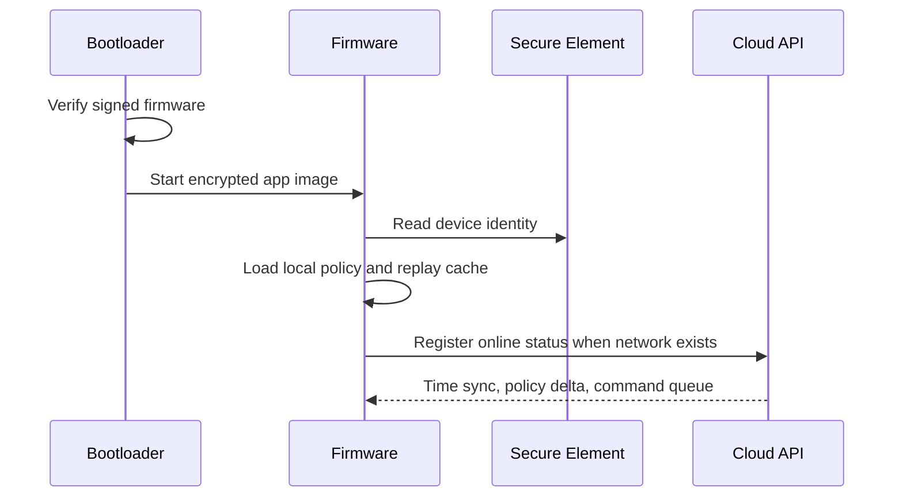
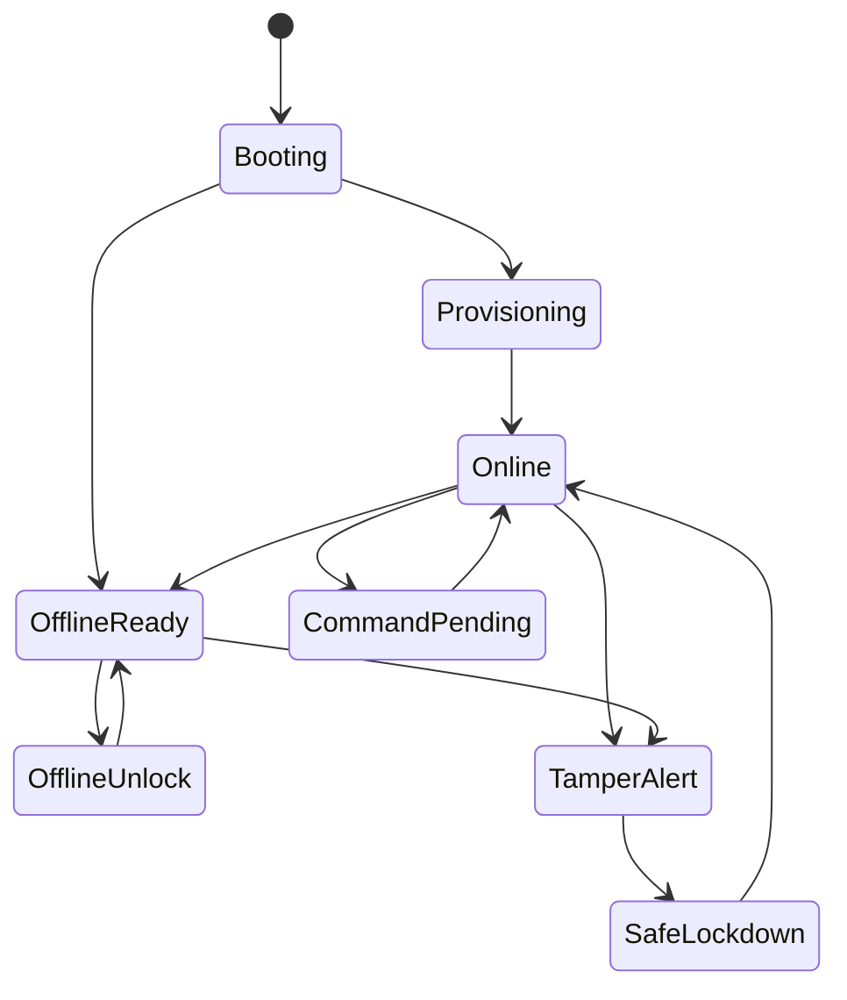

# Firmware Workflow

## Firmware Responsibilities

- Secure boot.
- Flash encryption.
- Device identity through secure element.
- LTE/MQTT or HTTPS telemetry.
- BLE unlock challenge-response.
- Optical unlock decoding.
- Offline token validation.
- OBD-II/CAN polling.
- GNSS location capture.
- IMU event detection.
- Lock actuator control.
- Tamper detection.
- OTA updates.
- Local event queue and sync.

## Boot Sequence

## Device State Machine

## Offline Event Queue

The device stores these records while offline:

- Access attempts.
- Unlock accepted/rejected.
- Tamper events.
- GNSS snapshots.
- Command acknowledgements.
- Trip start/end summary.
- Critical sensor events.

When connectivity returns, the firmware uploads events in timestamp order with local sequence numbers.

## OTA Rules

- Firmware image must be signed.
- Device must verify firmware before boot.
- Rollout must support staged deployment by organization, branch, hardware version, and device cohort.
- Device must keep a rollback partition.
- Failed boot count should trigger rollback.
- Critical access policy updates should be separate from full firmware where possible.

## Factory Provisioning

1. Flash manufacturing firmware.
2. Generate or inject secure element private key.
3. Register public key, secure element serial, hardware version, and device serial in backend.
4. Run LTE, GNSS, BLE, optical, CAN, lock output, and tamper tests.
5. Flash production firmware.
6. Enable secure boot and flash encryption.
7. Disable or lock debug interfaces.
8. Print enclosure QR code with device serial.
9. Pack device with installation harness and test certificate.
