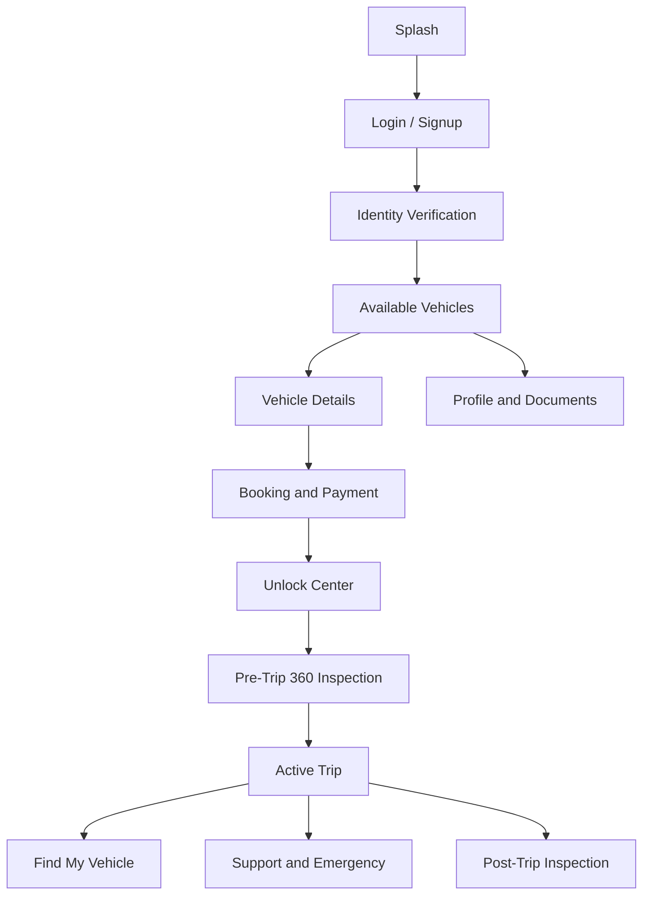
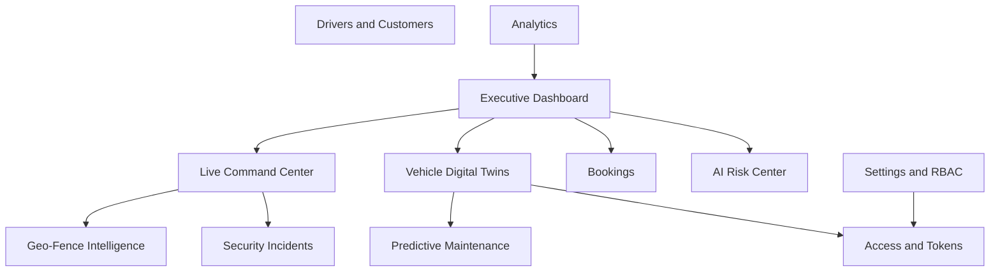

# Mobile and Web Screen Architecture

## Apps

- Customer mobile app
- Driver mobile app
- Staff mobile app
- Maintenance mobile app
- Owner and manager web console
- Platform admin web console

## Customer App Screens

## Manager Web Console

## Maintenance App Screens

- Assigned work orders
- Vehicle diagnostics
- Predictive health alerts
- Service checklist
- Parts used
- Service photos
- Test drive report
- Close work order

## Staff App Screens

- Today bookings
- Customer check-in
- Identity review
- Vehicle handoff
- Inspection capture
- Emergency unlock approval
- Return processing
- Payment issue handling

## Driver App Screens

- Assigned vehicle
- Shift start verification
- Unlock center
- Trip route
- Driver behavior feedback
- Incident reporting
- Shift end inspection

## Unlock Center

Unlock methods shown by availability:

- Internet app unlock
- Bluetooth unlock
- Optical flashlight unlock
- NFC unlock
- QR emergency unlock
- Offline token unlock

The app should always show the safest available method first. If internet is down, it should automatically offer Bluetooth or optical unlock without making the user understand the network failure.
