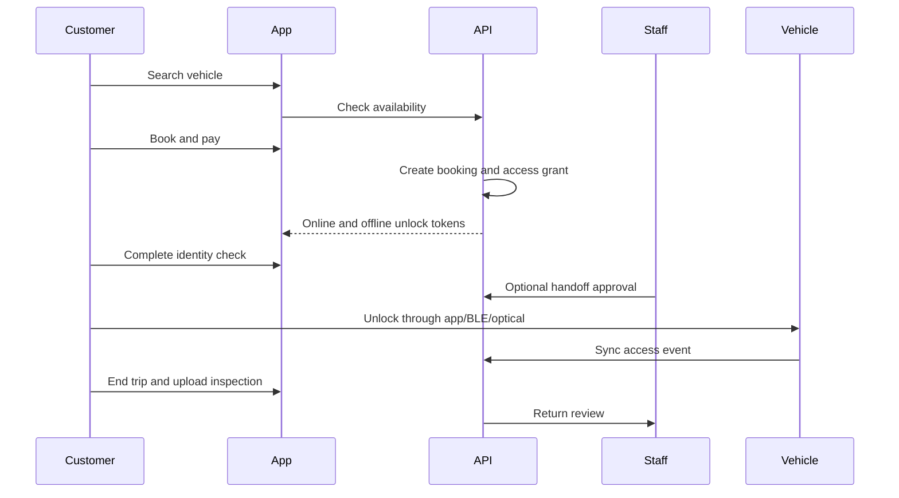

# Full Production Workflow

## 1. Organization Onboarding

1. Platform admin creates organization.
2. Owner verifies company details.
3. Branches and depots are added.
4. Roles and permissions are configured.
5. Payment, billing, and rental policies are configured.

## 2. Vehicle Onboarding

1. Create vehicle digital twin.
2. Upload registration, insurance, permit, pollution, and service documents.
3. Install FlashFleet vehicle box.
4. Pair device serial with vehicle.
5. Run installation checklist.
6. Verify GPS, LTE, BLE, optical unlock, lock output, CAN/OBD, tamper, and backup battery.
7. Mark vehicle as available.

## 3. Customer Rental Workflow

## 4. Command Center Workflow

1. Manager opens live map.
2. Filters by branch, status, vehicle class, risk, or alert.
3. Selects vehicle.
4. Reviews digital twin and latest state.
5. Sends approved command or assigns task.
6. System validates RBAC and safety state.
7. Device executes command.
8. Audit log records command and acknowledgement.

## 5. Maintenance Workflow

1. AI creates maintenance prediction.
2. Manager reviews explanation and severity.
3. Work order is created.
4. Maintenance team inspects vehicle.
5. Service photos and notes are uploaded.
6. Parts and cost are recorded.
7. Vehicle returns to available status after test checklist.

## 6. Incident Workflow

1. Theft, tamper, crash, geofence, or distress event is detected.
2. Command center receives critical alert.
3. System increases telemetry frequency.
4. Manager confirms incident.
5. Safe response policy is applied.
6. Incident report is generated with timeline, location, commands, and evidence.
7. Post-incident review updates risk and policy rules.

## 7. Offline Unlock Workflow

1. Backend issues offline token during booking or assignment.
2. Mobile app stores token in secure storage.
3. Vehicle goes offline or user enters basement parking.
4. App offers BLE or optical unlock.
5. Vehicle validates token locally.
6. Vehicle unlocks and stores access event.
7. Event syncs when network returns.

## 8. Firmware Release Workflow

1. Firmware change is peer reviewed.
2. Automated tests run on firmware simulator.
3. Hardware-in-loop tests run on device bench.
4. Signed release artifact is created.
5. Canary rollout starts with internal devices.
6. Rollout expands by branch and hardware version.
7. Failed devices auto-rollback.
8. Release report is archived.
