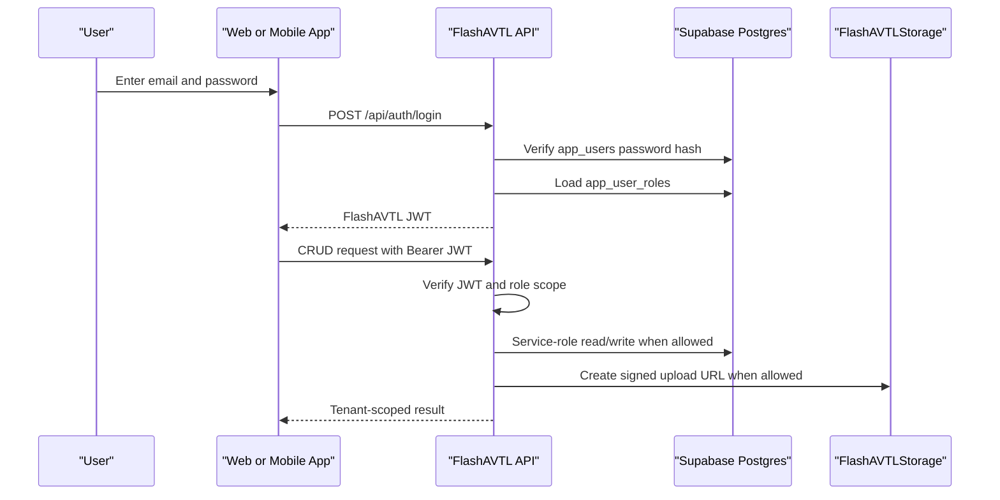

# JWT Authentication and Authorization Workflow

FlashAVTL uses application-owned JWT authentication for user identity and authorization. Supabase is used for PostgreSQL data and private Storage behind the FlashAVTL API; web and mobile clients do not sign in with Supabase Auth.

## Key Rules

- Web and mobile apps only receive `VITE_API_URL` / `EXPO_PUBLIC_API_URL`.
- The Supabase service-role key is only used by `services/api`.
- Every authenticated request carries a FlashAVTL application JWT.
- API authorization is based on `app_users` and `app_user_roles`.
- Database RLS remains enabled, but client writes go through API-side RBAC with the service role.
- Storage uses one private bucket, `FlashAVTLStorage`, with controlled folder prefixes.
- Firmware upload and admin user provisioning must go through the backend API.

## Runtime Flow



## Roles

| Role | Intended Scope |
| --- | --- |
| `platform_admin` | Platform-wide setup, firmware artifacts, emergency support. |
| `owner` | Company tenant ownership, users, fleet, billing, reports. |
| `manager` | Branch and operational management. |
| `staff` | Booking, inspection, handoff, support workflows. |
| `driver` | Assigned trips, inspections, vehicle access. |
| `customer` | Own bookings, own access grants, own damage submissions. |
| `maintenance` | Vehicle health, service documents, maintenance workflows. |

## Application Workflows

### Sign In

1. App calls `POST /api/auth/login` with email and password.
2. API verifies the `app_users.password_hash` value.
3. API loads `app_user_roles` and returns a signed FlashAVTL JWT.
4. UI enables module actions based on the JWT-backed role context returned by `/api/auth/me`.

### Create User

1. Admin uses the web or mobile create-user form for invitation tracking.
2. The form calls `POST /api/admin/users`.
3. API verifies the FlashAVTL JWT.
4. API checks `platform_admin`, `owner`, or `manager`.
5. API creates or updates `app_users`.
6. API writes `app_user_roles`, `user_invitations`, and `audit_logs`.

### Create Vehicle, Bus, Truck, Ship, or Equipment

1. Operator selects an asset type from `asset_types`.
2. App calls `POST /api/fleet-assets`.
3. API allows only fleet operators for the organization.
4. Future device provisioning writes to `vehicle_devices` through an admin workflow.

### Upload Files

1. App requests `POST /api/storage/signed-upload`.
2. API validates role and section before creating a signed upload URL.
3. App uploads to `FlashAVTLStorage` using the signed URL.
4. API records metadata in `storage_files`.

Allowed prefixes:

- `vehicle-documents`
- `damage-media`
- `identity-evidence`
- `inspection-media`
- `firmware-artifacts`

## Required Environment

Frontend:

```bash
VITE_API_URL=http://localhost:8787
EXPO_PUBLIC_API_URL=http://localhost:8787
```

Backend API:

```bash
SUPABASE_URL=
SUPABASE_SERVICE_ROLE_KEY=
APP_JWT_SECRET=
APP_JWT_EXPIRES_SECONDS=28800
PORT=8787
CORS_ORIGINS=http://localhost:3000
```

## Production Hardening

- Enable MFA for `platform_admin`, `owner`, and `manager`.
- Add rate limits to `services/api`.
- Keep service-role secrets out of Vite, Expo, and client bundles.
- Rotate `APP_JWT_SECRET` with a key-id strategy before multi-tenant production rollout.
- Use short-lived signed upload URLs for sensitive media.
- Add API authorization tests for every role before launch.
- Audit every command that can lock, unlock, immobilize, upload firmware, or modify user roles.
