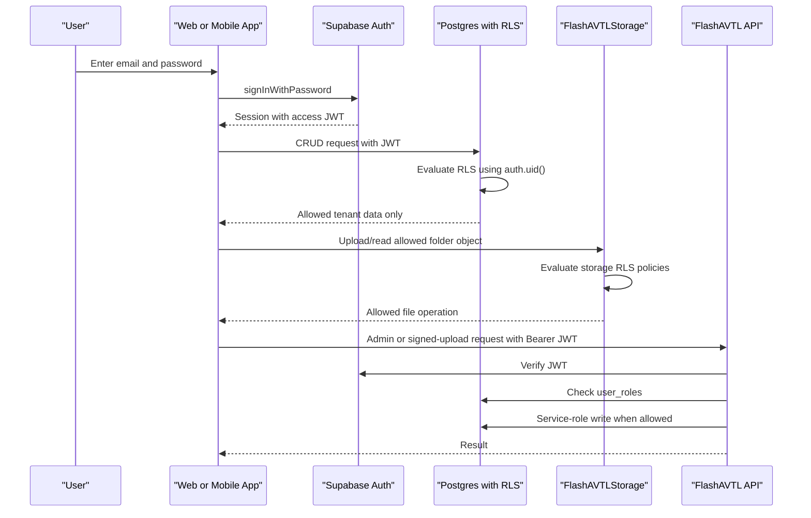

# JWT Authentication and Authorization Workflow

FlashAVTL uses Supabase Auth for user identity, PostgreSQL RLS for tenant-safe table access, private Supabase Storage for files, and a small Node API for operations that require the service-role key.

## Key Rules

- Web and mobile apps only receive the Supabase anon key.
- The Supabase service-role key is only used by `services/api`.
- Every authenticated request carries a Supabase JWT.
- Database access is protected by RLS policies tied to `user_roles`.
- Storage uses one private bucket, `FlashAVTLStorage`, with controlled folder prefixes.
- Firmware upload and admin user provisioning must go through the backend API.

## Runtime Flow



## Roles

| Role | Intended Scope |
| --- | --- |
| `platform_admin` | Platform-wide setup, firmware artifacts, emergency support. |
| `owner` | Company tenant ownership, users, fleet, billing, reports. |
| `manager` | Branch and operational management. |
| `staff` | Booking, inspection, handoff, support workflows. |
| `driver` | Assigned trips, inspections, vehicle access. |
| `customer` | Own bookings, own access grants, own damage submissions. |
| `maintenance` | Vehicle health, service documents, maintenance workflows. |

## Application Workflows

### Sign In

1. App calls Supabase Auth with email and password.
2. Supabase returns a session and JWT.
3. App loads `profiles` and `user_roles`.
4. UI enables module actions based on role and live RLS results.

### Create User

1. Admin uses the web or mobile create-user form for invitation tracking.
2. For production Auth user creation, call `POST /api/admin/users`.
3. API verifies the caller JWT.
4. API checks `platform_admin`, `owner`, or `manager`.
5. API uses the service-role key to create/invite the Supabase Auth user.
6. API writes `profiles`, `user_roles`, `user_invitations`, and `audit_logs`.

### Create Vehicle, Bus, Truck, Ship, or Equipment

1. Operator selects an asset type from `asset_types`.
2. App inserts into `vehicles`.
3. RLS allows only fleet operators for the organization.
4. Future device provisioning writes to `vehicle_devices` through an admin workflow.

### Upload Files

1. App uploads to `FlashAVTLStorage` using one allowed prefix.
2. App writes metadata to `storage_files`.
3. For sensitive or large uploads, app requests `POST /api/storage/signed-upload`.
4. API validates role and section before creating a signed upload URL.

Allowed prefixes:

- `vehicle-documents`
- `damage-media`
- `identity-evidence`
- `inspection-media`
- `firmware-artifacts`

## Required Environment

Frontend:

```bash
VITE_SUPABASE_URL=
VITE_SUPABASE_ANON_KEY=
EXPO_PUBLIC_SUPABASE_URL=
EXPO_PUBLIC_SUPABASE_ANON_KEY=
```

Backend API:

```bash
SUPABASE_URL=
SUPABASE_ANON_KEY=
SUPABASE_SERVICE_ROLE_KEY=
PORT=8787
CORS_ORIGINS=http://localhost:3000
AUTH_REDIRECT_URL=http://localhost:3000
```

## Production Hardening

- Enable MFA for `platform_admin`, `owner`, and `manager`.
- Add rate limits to `services/api`.
- Keep service-role secrets out of Vite, Expo, and client bundles.
- Use short-lived signed upload URLs for sensitive media.
- Add RLS tests for every role before launch.
- Audit every command that can lock, unlock, immobilize, upload firmware, or modify user roles.
