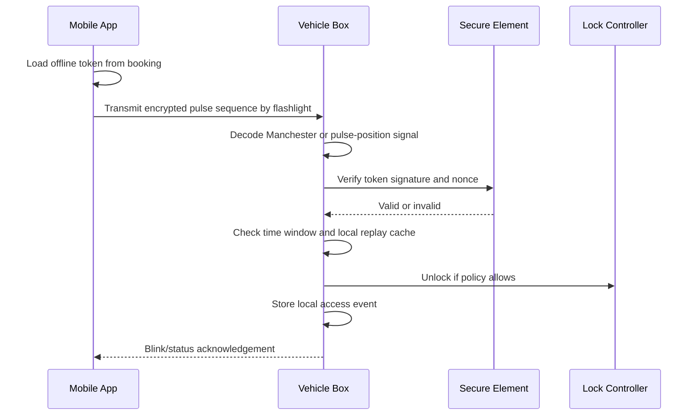

# Secure Access Workflow

## Access Methods

| Method | Online Required | Best Use |
| --- | --- | --- |
| App unlock | Yes | Normal customer, driver, or staff unlock. |
| Bluetooth unlock | No | Basement parking, weak mobile network, nearby vehicle. |
| Optical flashlight unlock | No | Unique backup access through encrypted light pulse. |
| NFC card unlock | No | Staff, maintenance, enterprise drivers. |
| QR emergency unlock | Sometimes | Assisted recovery and support workflows. |
| Offline token unlock | No | Pre-issued access during booking or assignment window. |

## Offline Unlock Token Design

Token constraints:

- Organization-bound.
- Vehicle-bound.
- User-bound.
- Access-method-bound.
- Validity window limited.
- Use count limited.
- Signed by backend private key.
- Verifiable by the vehicle secure element public key set.
- Includes nonce to prevent replay.

Recommended payload:

```json
{
  "version": 1,
  "organization_id": "uuid",
  "vehicle_id": "uuid",
  "user_id": "uuid",
  "access_grant_id": "uuid",
  "method": "optical",
  "action": "unlock",
  "valid_from": "2026-05-20T10:00:00Z",
  "valid_until": "2026-05-20T12:00:00Z",
  "max_uses": 1,
  "nonce": "128-bit-random"
}
```

## Optical Unlock Flow



## Optical Signal Design

Recommended design:

- Modulation: Manchester encoding or pulse-position modulation.
- Preamble: fixed timing sync pattern.
- Payload: compact binary token reference plus signature fragment or encrypted offline token.
- Error detection: CRC plus signature validation.
- Replay defense: nonce cache on device.
- User feedback: vehicle LED or horn chirp pattern, configurable by tenant.

## Bluetooth Unlock Flow

- Mobile app scans for assigned vehicle BLE advertisement.
- Vehicle sends challenge.
- Mobile signs challenge using session token.
- Vehicle validates backend-issued signed grant.
- Vehicle unlocks only if time, user, and vehicle match.

## Online Command Flow

- User requests unlock.
- API checks RBAC and booking.
- API creates command with expiration.
- Command service signs payload.
- Device verifies signature.
- Device executes command.
- Device sends acknowledgement.
- Audit log stores result.

## Safety and Security Controls

- Use secure element for device private keys.
- Enable microcontroller secure boot and flash encryption.
- Store no raw unlock token on backend after issuing; store only hash and metadata.
- Require device clock hardening with server time sync and drift limit.
- Keep local replay cache on the vehicle box.
- Rate-limit failed optical and Bluetooth attempts.
- Lock out repeated failed attempts until manager review.
- Log every access attempt, successful or failed.
